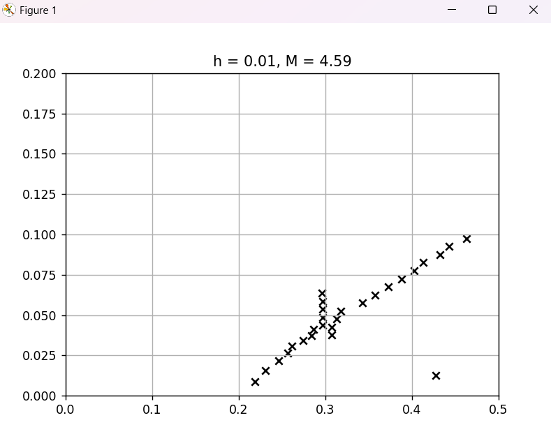
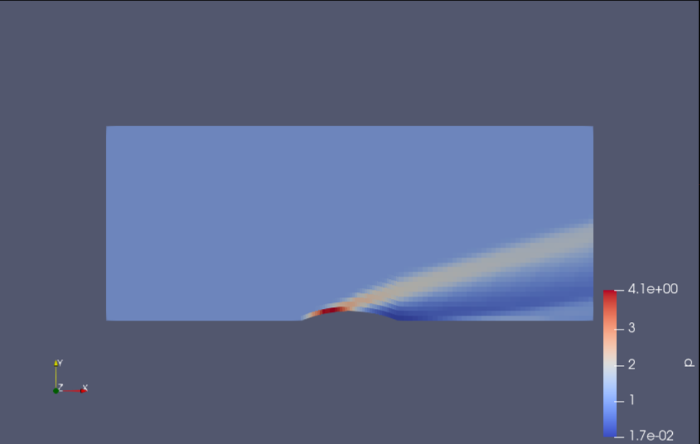

# ShockData
Datathon 2023 Submission

## Setup

- Install packages through `pip install -r requirements.txt`

- Run `shock_plotter.py` with values for args `ellipse_height` and `mach` (e.g. `python3 shock_plotter.py 0.01 4.59`)
  - `ellipse_height` represents the semi-minor axis of the elliptical airfoil (0.05 is always the semi-major axis)
  - `mach` represents the free-stream velocity over the free-stream speed of sound
  - Output: 

- To generate your own data using `generate_cfd_dataset.py`:
  - Install OpenFOAM: <https://openfoam.org/download/11-ubuntu>
  - User Guide: <https://doc.cfd.direct/openfoam/user-guide-v11/index>
  - In file, two variables:
    - `M_n`: number of free-stream mach values to generate between a mach value of 1.3 and 5.0
    - `h_n`: number of airfoil geometries to generate between an ellipse_height value between 0.005 and 0.01
  - Preview mesh: 

- Code for verification and validation of dataset is in `shock_analysis.ipynb`

## Dataset format

- In data folder, the subfolders are organized by `ellipse_height`, with the csv files representing the plot given a `mach` value at that height
- CSV file with `x` and `y` columns for each point on the airfoil
